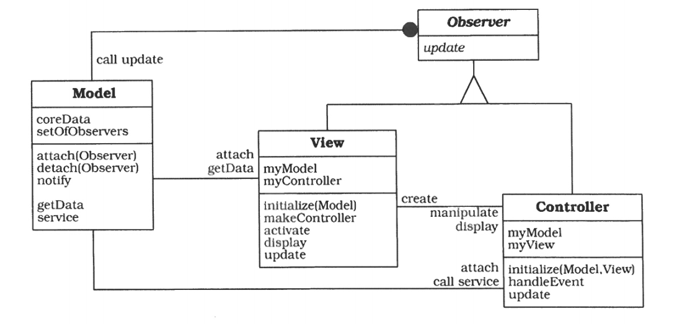

# Model-View-Controller

## 示例

通过电子表格来输入数据，通过多种图表来显示数据。


## 背景

具有灵活人机交互界面的交互式应用程序。

## 问题


## 解决方案

- Model: 包含核心功能和数据，独立于输出的表示方式和输入行为；
- View: 向用户显示信息，并从 Model 中获取数据。同一个 Model 可以有多个不同的 View；
- Controller: 处理用户输入；每个 View 都有相关联的 Controller，如果用户通过一个 View 的 Controller 修改了 Module，那么变化应当在所有的 View 中反映出来。

## 结构

- Module 应当给 Controller 提供修改数据的 procedure，并且给 View 提供获取数据的函数；
- **变更传播机制**（change-propagation mechanism）：在 Model 中维护一个注册表，所有的 View 以及部分 Controller 会在表内留下信息，告诉 Module 发生哪些变化时需要通知他们。变更传播机制是 Module 与 View 和 Controller 联系的**唯一渠道**；
- 每个 View 都定义了一个更新过程，由变更传播机制激活；
- 初始化阶段，所有的 View 都与 Module 直接关联，向变更传播机制注册并创建属于自己的 Controller；如果 Controller 的行为依赖于 Module 的状态，那么他也会向变更传播机制注册；（参考[示例](#示例)，柱状图和饼状图的 Controller 不会影响 Module，但是表格用于输入数据，其 Controller 会影响 Module）

## 动态

### 情景1

用户输入导致模型发生了变化，进而触发变更传播机制。


### 情景2

初始化 MVC 模式中的组件.


attach 表示向变更传播机制注册。

## 实现



### 将人机交互与核心功能分离

```c++
class Model {
	List<long>   votes;
	List<String> parties;
public:
	Model(List<String> partyNames);
    
	// access interface for modification by controller
	void clearVotes(); // set voting values to 0
	void changeVote(String party, long vote);
    
	// factory functions for view access to data
	Iterator<long> makeVoteIterator() {
		return Iterator<long>(votes);
	}
	Iterator<String> makePartyIterator() {
		return Iterator<String>(parties);
	}
// ... to be continued
}
```

- Module 组件包含了两个等长列表 `parties` 和 `votes`，用来存储政党名和票数；
- 提供用于访问数据的两个迭代器：`makePartyIterator` 和 `makeVoteIterator`；
- 提供给 Controller 的用于修改数据的两个方法：`clearVotes` 和 `changeVote`；

### 实现变更传播机制

```c++
class Observer { // common ancestor for view and controller
public :
	virtual void update() { }
// default is no-op
};
class Model {
// ... continued
public:
	void attach(Observer *s) { registry.add (s); }
	void detach(Observer *s) { registry.remove (s); }
protected:
	virtual void notify();
private :
	Set<Observer*> registry;
};
```

- 用 Observer 来指代 View 和 Controller，让 View 和 Controller 都[继承](https://www.runoob.com/cplusplus/cpp-inheritance.html) Observer；
- 可以对 Module 进行 `attach/detach` 来注册/取消注册 Observer；
- `notify()` 遍历了注册表 `registry` 中所有的 Observer 对象并调用其更新方法 `update()`，从而实现在数据更新后更新 View 和 Controller；

```c++
void Model::notify() {
	// call update for all observers
	Iterator<Observer*> iter(registry);
	while (iter.next()) {
		iter.curr() -> update( );
	}
}
```

### 设计并实现 View

View 主要需要三个模块：init、update、draw。

```c++
class View : public Observer {
public:
	View(Model *m) : myModel(m), myController(0)
		{ myModel -> attach(this); }
	virtual ~View() { myModel ->detach(this); }
	virtual void update() { this->draw0; }
	// abstract interface to be redefined:
	virtual void initialize(); // see below
	virtual void draw(); // (re-)display view
TODO
```

### 设计并实现 Controller

### 设计并实现 View-Controller 关系

### 实现搭建 MVC 的代码

## TODO
https://www.garfieldtech.com/blog/mvc-vs-pac