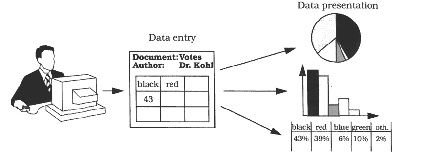
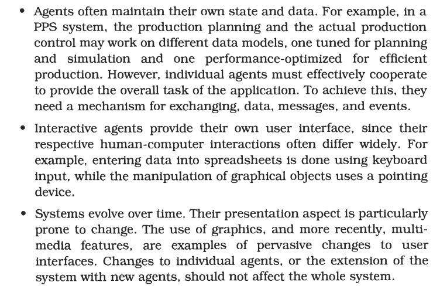
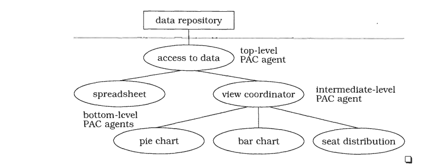
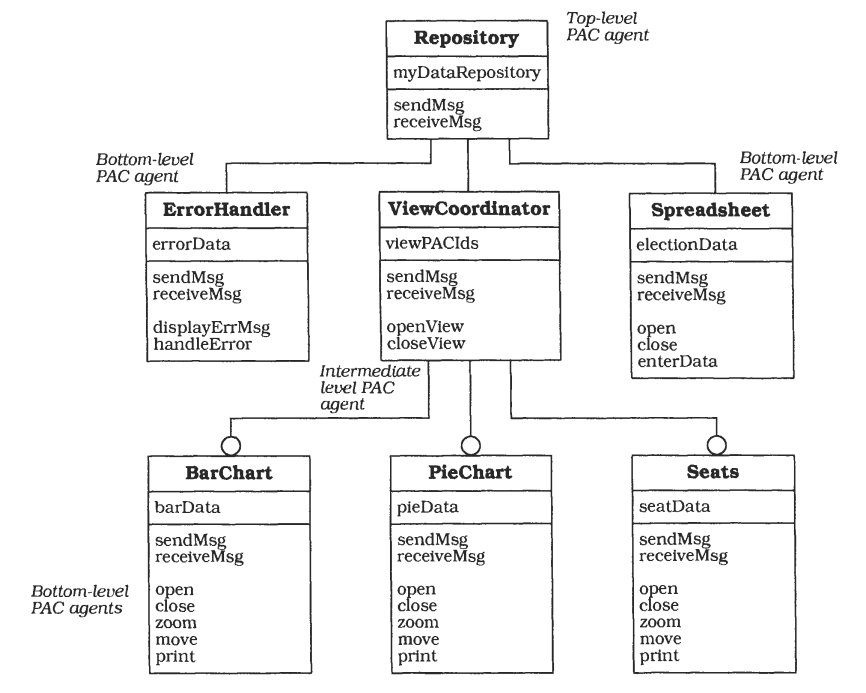
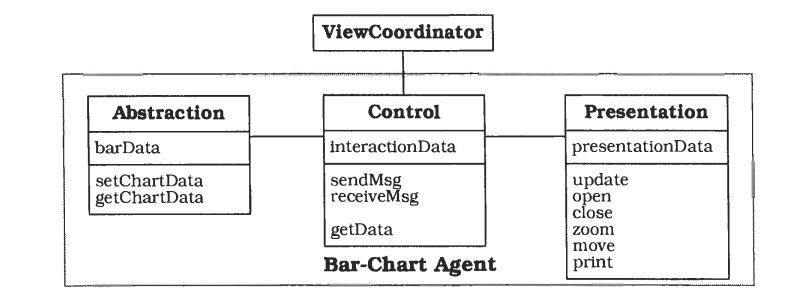

# Presentation-Abstraction-Control

PAC 由相互协作的 agents 组成层次结构，每个 agent 都负责应用程序功能的特定方面，并包含三个组件：presentation、abstraction、control，从而实现 agent 的人机交互功能与核心功能、与其他 agent 通信功能的分离。

## 示例

不同版本将根据具体需求来调整用户界面。

## 背景

利用 [agent](https://en.wikipedia.org/wiki/Software_agent) 开发交互式应用程序。

## 问题

## 解决方案

由图可见，一般将 agents 组织为树形结构，下层 agent 依赖于所有上层 agent。可以粗略地将 agent 分为上层、中层、下层 agent。在上图中，spreadsheet、pie chart bar chart、seat distribution 都是底层 agent，view coordinator 是中层 agent，access to data 是上层 agent。

## 结构

